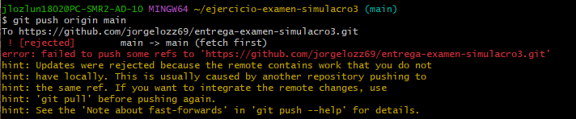
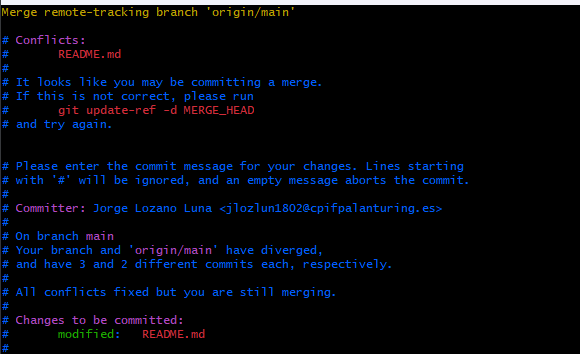
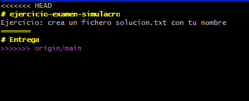
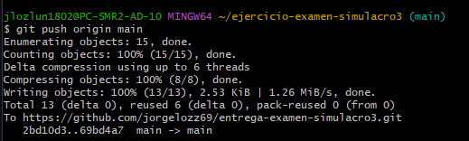
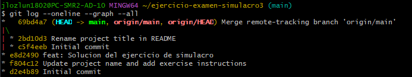
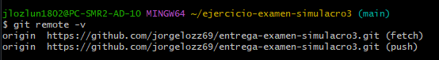

# Entrega
Ejercicio: crea un fichero solucion.txt con tu nombre

Captura del error de push rechazado (paso 3.3)

Captura del conflicto en README.md y de su resolución

Captura de git log --oneline --graph --all en el repositorio local, mostrando el commit de fusión de historiales no relacionados

Captura final de git remote -v confirmando que origin apunta al repositorio de entrega

